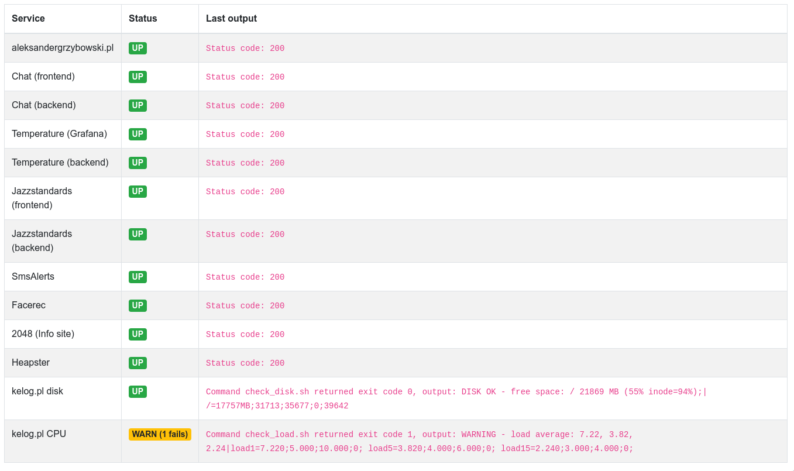

A small project I did just for fun. Useful for keeping my projects up and running - Icinga/Zabbix is kinda overkill, so I wanted to build something smaller myself.

Solutions used:
* Spring Boot
* React
* Kubernetes

